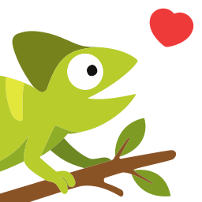
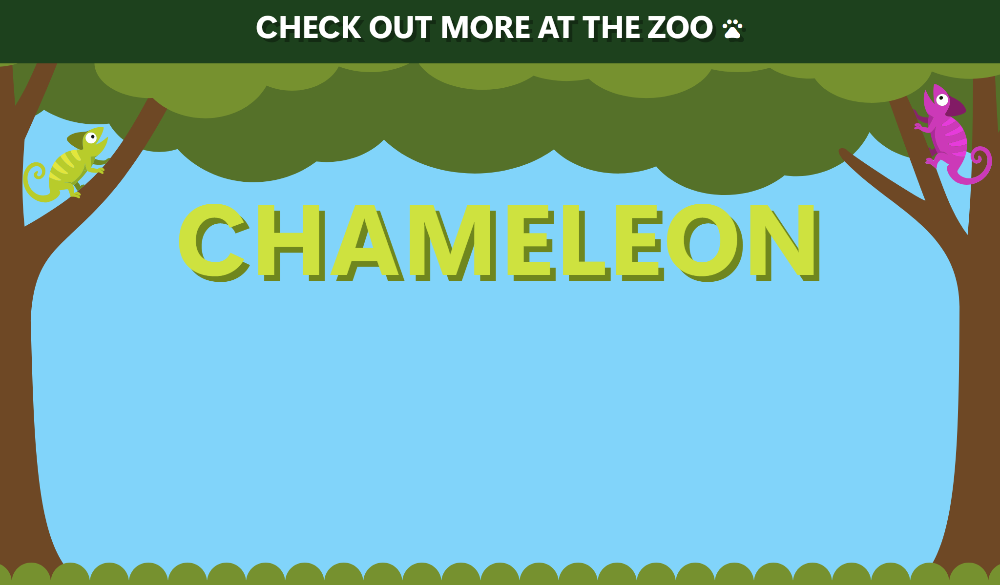
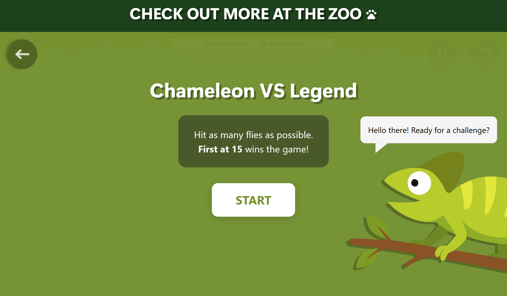

<h1 align="center">🐾 The Zoo - Chameleon 🐾</h1>

  
  
  
  

  

**The Zoo** is an interactive webpage about the chameleon (the best animal on earth), built with SvelteKit for the YSWS [Hack Club Zoo](https://zoo.hackclub.com/). It covers information about it and includes an interactive page where you can play with it at the end of the reading.

<!-- <h3 align="left" style="display: flex; align-items: center; justify-content: center; gap: 7px;">
  Currently: 0 
</h3> -->

  <a href="https://xen0r-star.github.io/The-Zoo/">
    <h3>
      👉 Live Demo 👈
    </h3>
  </a>

<!-- TABLE OF CONTENTS -->

  
🗂️ Table of Contents

  <ol>
    <li>
      <a href="#📌-requirements">📌 Requirements</a>
    </li>
    <li>
      <a href="#✨-information-about-the-chameleon">✨ Information about the chameleon</a>
    </li>
    <li>
      <a href="#🦎-interactive-elements">🦎 Interactive elements</a>
    </li>
    <li>
      <a href="#🎨-figma-design">🎨 Figma Design</a>
    </li>
    <li>
      <a href="#📸-screenshots">📸 Screenshots</a>
    </li>
    <li>
      <a href="#🛠️-technologies">🛠️ Technologies</a>
    </li>
    <li>
      <a href="#🥚-easter-eggs">🥚 Easter Eggs</a>
    </li>
    <li>
      <a href="#🏆-credits">🏆 Credits</a>
    </li>
  </ol>

---

## 📌 Requirements
- **Main requirements**:
  - [X] 8+ hours of coding
  - [x] Site coded with SvelteKit and statically hosted on GitHub Pages
  - [x] Theme around the best animal (the chameleon of course)
  - [x] Include the Zoo Banner component everywhere
  - [x] Include the README.md file with a description
  - [x] Information panel [5/3]
  - [x] Information panel uses $state and $derived
  - [x] Unlock a button after reading all facts
  - [] Earn mynts
- **Bonus requirements**:
  - [X] Extra hours (8h + 27h = 35h)
  - [X] Use of svelte:head in +layout.svelte
  - [X] Animal conservation status according to IUCN
  - [X] The facts panel is fully dynamic
  - [X] Use of $effect on the main page and the interactive page
  - [X] Presence of easter eggs (3/3)
  - [X] Site 100% responsive ON ALL DEVICES (except Apple Watch)

(<a href="#readme-top">back to top</a>)

---

## ✨ Information about the chameleon
### Main page
On the main page, the user takes a short journey through the trees, discovers several sections with detailed information (basics, camouflage and tongue, endangered status), checks an interactive information panel offering fun and educational facts about the chameleon, and can unlock the “Meet Chameleon” button after reading all the facts.

(<a href="#readme-top">back to top</a>)

---

## 🦎 Interactive elements
### Interactive page
My interactive page is a simple game where the user must click on flies to score points before the chameleon catches them, just like a real chameleon would do to feed.

#### External stimulus
- **Clicks on the chameleon**: Clicking the chameleon triggers a color change—be careful not to click too many times.
- **Mouse movements**: The chameleon’s eye follows the user’s cursor.

#### Internal stimulus
- **Time**: The sky color changes dynamically according to the real time.
- **Flies**: It automatically catches the flies.
- **Randomness**: The chameleon sometimes makes a mistake and attacks the mouse cursor instead of the fly.
- **Daytime life**: The chameleon has a higher chance of hitting the fly from 8 a.m. to 8 p.m.
- **Speech**: The chameleon makes random comments depending on the situation (win/lose/pause).

(<a href="#readme-top">back to top</a>)

---

## 🎨 Figma Design

The design of this project was created in Figma.  
👉 [See the Figma here](https://www.figma.com/design/uUUiihiYirgn1eLlLTaem4/The-zoo?m=auto&t=nZ8xwFVnpctgNBH8-1)

(<a href="#readme-top">back to top</a>)

---

## 📸 Screenshots
<table>
  <tr>
    <td>
      
    </td>
    <td>
      
    </td>
    <td>
      
    </td>
  </tr>
  <tr>
    <td>
      
    </td>
    <td>
      
    </td>
    <td>
      
    </td>
  </tr>
  <tr>
    <td>
      
    </td>
    <td>
      
    </td>
    <td>
      
    </td>
  </tr>
</table>

(<a href="#readme-top">back to top</a>)

---

## 🥚 Easter Eggs
- 💚 Clicking the green chameleon in the tree will trigger a cute animation for his sweetheart in the tree opposite
- 🏪 A nice ASCII art hidden in the webpage’s source code
- 🖌️ The barcode leads to the best GitHub account

(<a href="#readme-top">back to top</a>)

---

## 🛠️ Technologies
- [![Svelte][Svelte.dev]][Svelte-url] 
- [![TypeScript][TypeScript.dev]][TypeScript-url] 
- [![Vite][Vite.dev]][Vite-url]

(<a href="#readme-top">back to top</a>)

---

## 🏆 Credits
- Designed by: [[xen0r-star]](https://github.com/xen0r-star)
- Coded by: [[xen0r-star]](https://github.com/xen0r-star)
- Drawings by: [[xen0r-star]](https://github.com/xen0r-star)
- Original ideas: [[xen0r-star]](https://github.com/xen0r-star)
- Testing and debugging: [[xen0r-star]](https://github.com/xen0r-star)
- Documentation: [[xen0r-star]](https://github.com/xen0r-star)
- Chameleon animation: [[xen0r-star]](https://github.com/xen0r-star)
- UI/UX: [[xen0r-star]](https://github.com/xen0r-star)
- Project management: [[xen0r-star]](https://github.com/xen0r-star)
- Motivation and coffee: [[xen0r-star]](https://github.com/xen0r-star)

(<a href="#readme-top">back to top</a>)

---

  <i>🖤💛❤️ Made by a Belgian 🖤💛❤️</i>

[Svelte.dev]: https://img.shields.io/badge/Svelte-4A4A55?style=for-the-badge&logo=svelte&logoColor=FF3E00
[Svelte-url]: https://kit.svelte.dev/
[TypeScript.dev]: https://img.shields.io/badge/Typescript-4A4A55?style=for-the-badge&logo=typescript&logoColor=3178C6
[TypeScript-url]: https://www.typescriptlang.org/
[Vite.dev]: https://img.shields.io/badge/Vite-4A4A55?style=for-the-badge&logo=vite&logoColor=646CFF
[Vite-url]: https://vitejs.dev/
